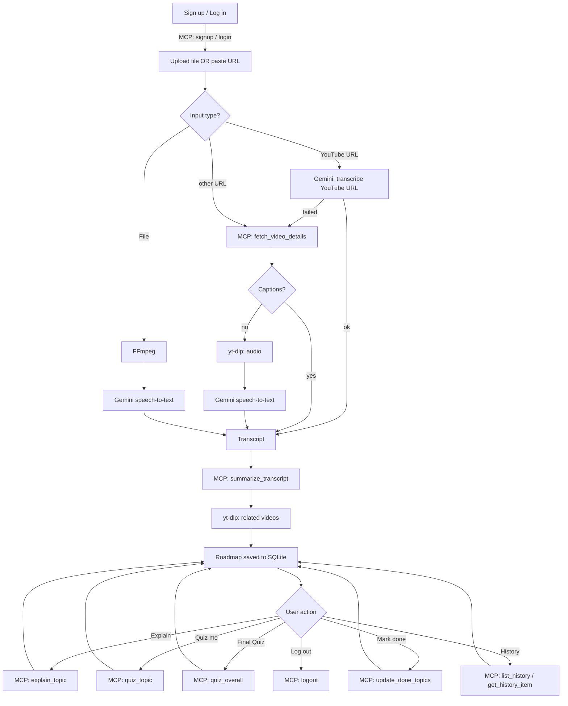

# AI-Video-Knowledge-Extractor

Turns a video (file or URL) into an interactive learning roadmap — intro, key points, topic tree, AI explanations, and quizzes — with accounts and per-user history. SvelteKit frontend, FastAPI backend, MCP tool server, SQLite, Docker.

## Architecture

```
YouTube URL ──► Gemini STT (Google fetches the video) ───────────────────────► Gemini ─┐
     │ (if Gemini can't)                                                               │
     ▼                                                                                 │
Video URL ──► MCP: fetch_video_details ─┬─ captions ─────────────────────────► Gemini ─┤
                                         └─ no captions ─► yt-dlp audio ─► Gemini STT ─┘
Uploaded file ──► FFmpeg (MP3) ──► Gemini STT ──► Gemini
                                              │
                                              ▼
                                   Roadmap + Quizzes (MCP tools)
                                              │
                                              ▼
                          SvelteKit ◄──► FastAPI ◄──► SQLite (accounts + history)
```

- **Frontend** (`frontend/`): SvelteKit, routes = `/` (upload), `/history`, `/analysis/[id]`, shared layout for auth/theme.
- **Backend** (`backend/main.py`): FastAPI. Every Gemini/yt-dlp/account/history operation is proxied through one local **MCP tool server** (`backend/mcp_server/`), auto-spawned by `main.py` — except speech-to-text (`services/transcriber.py`), which FastAPI calls directly.
- **Data**: SQLite (`backend/app.db`) — users, sessions, analyses (with per-topic done-state).
- **Docker**: `docker-compose.yml` builds both services; backend DB path is a mounted volume.

## Flow



## MCP Tools

Every Gemini/yt-dlp call (apart from speech-to-text), and every account/history read or write, goes through one local MCP tool server (`backend/mcp_server/video_details_server.py`), auto-spawned by `main.py` on startup. FastAPI otherwise never touches Gemini, yt-dlp, or the database directly — it's a thin HTTP layer that calls these tools and returns the result. That means the same tools are callable by any MCP client, not just this app's own frontend.

| Tool | Args | What it does |
|---|---|---|
| `fetch_video_details` | `url` | Reads a video's existing captions/subtitles via `yt-dlp` — no video or audio download. Raises a distinct error if no captions exist, so the caller knows to fall back to audio transcription. |
| `summarize_transcript` | `transcript`, `target_language?` | Sends the transcript to Gemini, gets back `intro`, `key_points`, and a nested `roadmap` of topics/sub-topics with examples. If `target_language` is set, the whole output is written in that language regardless of the transcript's own. |
| `explain_topic` | `heading`, `content`, `example?` | Asks Gemini to go deeper on one roadmap topic — context, nuance, common misconceptions — beyond what's already in `content`. |
| `quiz_topic` | `heading`, `content`, `example?` | Gemini generates a 5-question multiple-choice quiz scoped to just that topic, difficulty-tagged, code-aware if the topic has a code example. |
| `quiz_overall` | `roadmap`, `count` | Gemini generates a 10-15 question quiz spanning the whole roadmap, for the "Final Quiz" feature. |
| `signup` | `email`, `password` | Creates an account (password hashed + salted before storage) and returns a session token. |
| `login` | `email`, `password` | Verifies credentials and returns a fresh session token. |
| `logout` | `token` | Invalidates a session token. |
| `list_history` | `token` | Returns the *token owner's* saved analyses only — never another account's. |
| `get_history_item` | `token`, `analysis_id` | Returns one saved analysis by id, scoped to the token's account; errors if it belongs to someone else. |
| `update_done_topics` | `token`, `analysis_id`, `done_topics` | Overwrites which topics are marked done for one analysis, scoped the same way. |

Every account/history tool takes a `token` as its first argument, resolves it server-side to a `user_id`, and scopes the query to that user — the token is the only thing that ties a request to an account, so one account can never read or modify another's data.

## Sequence Diagram

```mermaid
sequenceDiagram
    actor User
    participant UI as SvelteKit
    participant API as FastAPI
    participant MCP as MCP Tools
    participant G as Gemini

    User->>UI: Sign up / Log in
    UI->>API: POST /api/auth/signup|login
    API->>MCP: signup / login
    MCP-->>API: token
    API-->>UI: token (stored, sent as Bearer)

    User->>UI: Analyze video
    UI->>API: POST /api/analyze (Bearer)
    API->>G: transcript (YouTube URL or audio → Gemini speech-to-text; or captions)
    API->>MCP: summarize_transcript
    MCP->>G: generate roadmap
    G-->>MCP: roadmap
    MCP-->>API: roadmap
    API-->>UI: render + save to History

    User->>UI: Explain / Quiz me / Final Quiz
    UI->>API: POST /api/topic/... 
    API->>MCP: explain_topic / quiz_topic / quiz_overall
    MCP->>G: generate
    G-->>MCP: result
    MCP-->>API: result
    API-->>UI: show panel / quiz

    User->>UI: Mark done / View History
    UI->>API: PUT done-topics / GET history
    API->>MCP: update_done_topics / list_history / get_history_item
    MCP-->>API: data
    API-->>UI: update view

    User->>UI: Log out
    UI->>API: POST /api/auth/logout
    API->>MCP: logout
```

## Why Each Technology

| Tech | Role |
|---|---|
| **SvelteKit** | UI: upload, roadmap, history, quizzes |
| **FastAPI** | HTTP orchestrator, auth guard |
| **MCP** | Single tool surface for every Gemini/yt-dlp/account/history op |
| **yt-dlp** | Fallback captions/audio download for URLs, related-video search — no API key |
| **FFmpeg** | Audio extraction (low-bitrate MP3) from uploaded files |
| **Gemini speech-to-text** | Transcribes YouTube URLs directly (no download, so no YouTube bot-wall on cloud hosts) and uploaded audio |
| **Gemini** | Roadmap generation, explanations, quizzes |
| **SQLite** | Accounts, sessions, saved analyses — one file, no extra service |

## Features

- Sign up / log in — private per-account history
- Upload a file **or** paste a URL; YouTube links go straight to Gemini, other URLs use captions first with a Gemini speech-to-text fallback
- Roadmap: intro, key points, nested topics with examples, related links, real related YouTube videos
- Output language override (translate the roadmap regardless of source language)
- **Explain** (deeper AI breakdown) / **Quiz me** (5 Qs) / **Final Quiz** (10-15 Qs) — difficulty-tagged, code-aware
- Mark topics done → progress bar, persisted server-side per analysis
- Search/filter roadmap topics
- Dark mode
- Export analysis to Markdown
- Docker Compose for both services

## Project Structure

**Backend**
- `main.py` — FastAPI routes + auth guard; `python main.py` starts API + MCP server
- `mcp_server/video_details_server.py` — all MCP tools (see table above)
- `services/mcp_client.py` — FastAPI's client for the MCP server
- `services/db.py` — SQLite (users, sessions, analyses)
- `services/downloader.py`, `audio_extractor.py`, `transcriber.py` — transcript pipeline
- `services/summarizer.py`, `topic_assistant.py` — Gemini prompts
- `services/video_search.py` — related-video search
- `Dockerfile`, `.dockerignore`

**Frontend** (`frontend/src/`)
- `routes/+layout.svelte` — theme toggle, account bar, auth gate
- `routes/+page.svelte` — upload form
- `routes/history/+page.svelte` — past analyses
- `routes/analysis/[id]/+page.svelte` — roadmap, quizzes, export
- `lib/auth.svelte.ts`, `lib/theme.svelte.ts` — shared reactive state
- `lib/types.ts`, `lib/languages.ts`, `lib/textUtils.ts` — shared helpers
- `app.css` — all styles (shared across routes)
- `Dockerfile`, `.dockerignore`

**Root**: `docker-compose.yml`, `.env.example`

## Out of Scope

- No async job queues — processing is synchronous per request
- No password reset / email verification
- No streaming progress during analysis

## Running Locally

**Docker (both services):**
```bash
cp .env.example .env   # set GEMINI_API_KEY
docker compose up --build
```

**Manual:**
```bash
cd backend
python3 -m venv venv && ./venv/bin/pip install -r requirements.txt
./venv/bin/python main.py       # API + MCP server on :8000

cd frontend
npm install && npm run dev      # :5173
```

Requires `GEMINI_API_KEY` (`backend/.env`, free at [aistudio.google.com/apikey](https://aistudio.google.com/apikey)) and `ffmpeg` on `PATH` for local dev.

## Deployment

- **Frontend → Vercel.** `vercel.json` builds only `frontend/`. The API base URL comes from `PUBLIC_API_URL` if set, otherwise production builds use the Render URL hard-coded in `frontend/src/lib/api.ts`.
- **Backend → Render**, from `backend/Dockerfile`. Set `GEMINI_API_KEY`. SQLite is wiped on every redeploy unless you attach a persistent disk and point `DB_PATH` at it. Set the health check path to `/api/health`.
- **Why not the backend on Vercel:** its serverless functions have a read-only filesystem and can't keep the MCP subprocess running.
- **YouTube on cloud hosts:** YouTube blocks yt-dlp from datacenter IPs ("Sign in to confirm you're not a bot"). Public YouTube links avoid this because Gemini fetches them on Google's side. Only the yt-dlp fallback needs `YTDLP_COOKIES_FILE` / `POT_PROVIDER_BASE_URL` (see `services/downloader.py`).
- **Gemini availability:** transcription tries several models in turn (`TRANSCRIPTION_MODELS` in `services/transcriber.py`), since individual models often return 503 "high demand" and pinned versions get retired. Free-tier limits apply, including a daily cap on YouTube video length processed.

## Status

Full pipeline, accounts, per-user history, all Gemini/yt-dlp/account/history ops as MCP tools, dark mode, export, and Docker are all in place end-to-end.
