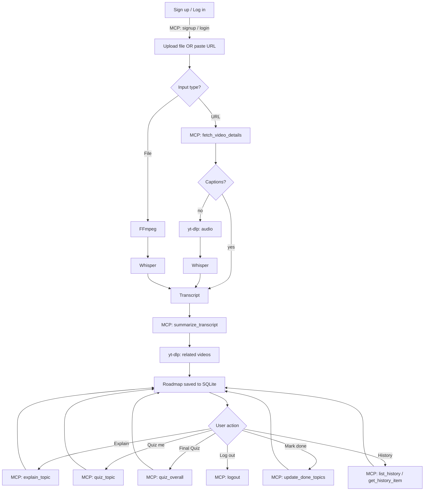
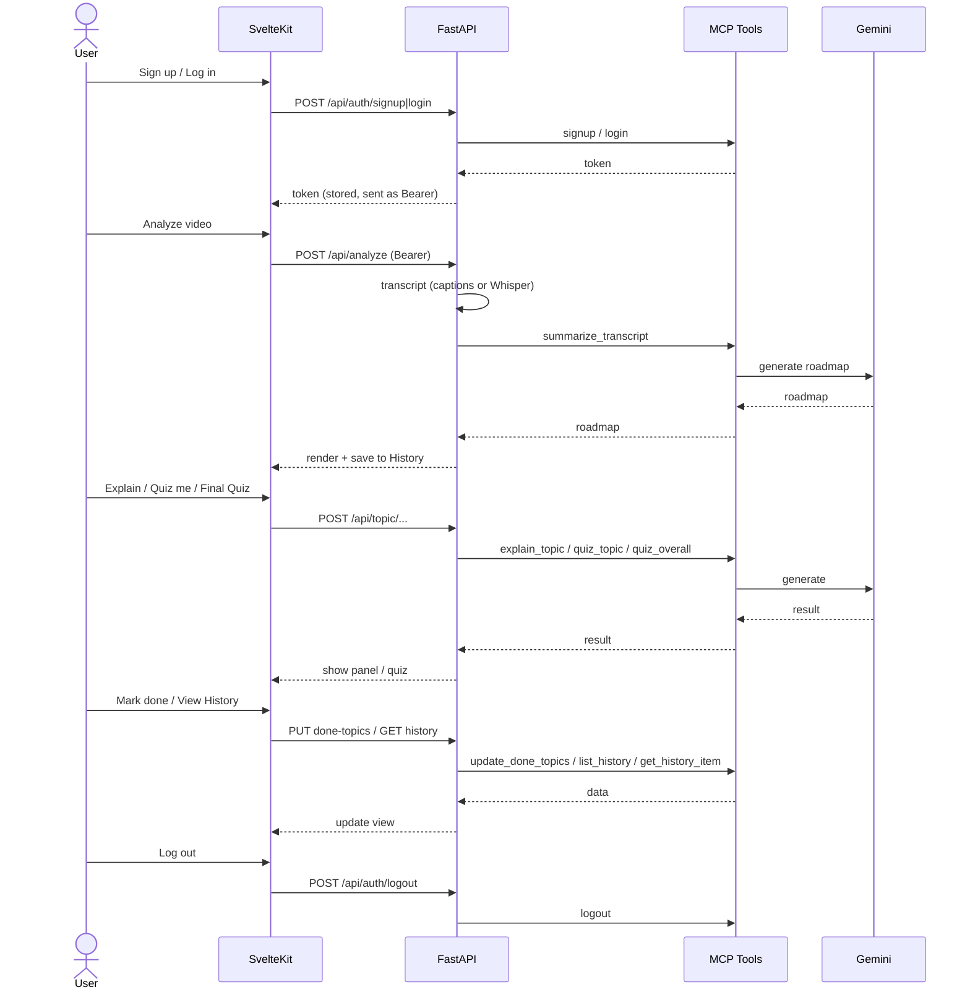

# AI-Video-Knowledge-Extractor

Turns a video (file or URL) into an interactive learning roadmap — intro, key points, topic tree, AI explanations, and quizzes — with accounts and per-user history. SvelteKit frontend, FastAPI backend, MCP tool server, SQLite, Docker.

## Architecture

```
Video URL ──► MCP: fetch_video_details ─┬─ captions ────────────────► Gemini ─┐
                                         └─ no captions ─► yt-dlp audio ─► Whisper ─┘
Uploaded file ──► FFmpeg ──► Whisper ──► Gemini
                                              │
                                              ▼
                                   Roadmap + Quizzes (MCP tools)
                                              │
                                              ▼
                          SvelteKit ◄──► FastAPI ◄──► SQLite (accounts + history)
```

- **Frontend** (`frontend/`): SvelteKit, routes = `/` (upload), `/history`, `/analysis/[id]`, shared layout for auth/theme.
- **Backend** (`backend/main.py`): FastAPI. Every Gemini/yt-dlp/account/history operation is proxied through one local **MCP tool server** (`backend/mcp_server/`), auto-spawned by `main.py`.
- **Data**: SQLite (`backend/app.db`) — users, sessions, analyses (with per-topic done-state).
- **Docker**: `docker-compose.yml` builds both services; backend DB path is a mounted volume.

## MCP Tools

| Tool | Backs |
|---|---|
| `fetch_video_details` | Read captions for a URL, no download |
| `summarize_transcript` | Gemini → intro + key points + roadmap |
| `explain_topic` | Gemini → deeper explanation for one topic |
| `quiz_topic` | Gemini → 5-question quiz for one topic |
| `quiz_overall` | Gemini → 10-15 question quiz for the whole roadmap |
| `signup` / `login` / `logout` | Account + session management |
| `list_history` / `get_history_item` | Browse/reopen a user's own saved analyses |
| `update_done_topics` | Persist "mark as done" per topic |

All account/history tools take a `token`; the server resolves it to a `user_id` internally, so one account can never read another's data.

## Flow



### Sequence Diagram



## Why Each Technology

| Tech | Role |
|---|---|
| **SvelteKit** | UI: upload, roadmap, history, quizzes |
| **FastAPI** | HTTP orchestrator, auth guard |
| **MCP** | Single tool surface for every Gemini/yt-dlp/account/history op |
| **yt-dlp** | Captions, audio download, related-video search — no API key |
| **FFmpeg** | Audio extraction from uploaded files |
| **Whisper** | Speech-to-text fallback (CPU) when no captions exist |
| **Gemini** | Roadmap generation, explanations, quizzes |
| **SQLite** | Accounts, sessions, saved analyses — one file, no extra service |

## Features

- Sign up / log in — private per-account history
- Upload a file **or** paste a URL; captions-first, Whisper fallback
- Roadmap: intro, key points, nested topics with examples, related links, real related YouTube videos
- Output language override (translate the roadmap regardless of source language)
- **Explain** (deeper AI breakdown) / **Quiz me** (5 Qs) / **Final Quiz** (10-15 Qs) — difficulty-tagged, code-aware
- Mark topics done → progress bar, persisted server-side per analysis
- Search/filter roadmap topics
- Dark mode
- Export analysis to Markdown
- Docker Compose for both services

## Project Structure

**Backend**
- `main.py` — FastAPI routes + auth guard; `python main.py` starts API + MCP server
- `mcp_server/video_details_server.py` — all MCP tools (see table above)
- `services/mcp_client.py` — FastAPI's client for the MCP server
- `services/db.py` — SQLite (users, sessions, analyses)
- `services/downloader.py`, `audio_extractor.py`, `transcriber.py` — transcript pipeline
- `services/summarizer.py`, `topic_assistant.py` — Gemini prompts
- `services/video_search.py` — related-video search
- `Dockerfile`, `.dockerignore`

**Frontend** (`frontend/src/`)
- `routes/+layout.svelte` — theme toggle, account bar, auth gate
- `routes/+page.svelte` — upload form
- `routes/history/+page.svelte` — past analyses
- `routes/analysis/[id]/+page.svelte` — roadmap, quizzes, export
- `lib/auth.svelte.ts`, `lib/theme.svelte.ts` — shared reactive state
- `lib/types.ts`, `lib/languages.ts`, `lib/textUtils.ts` — shared helpers
- `app.css` — all styles (shared across routes)
- `Dockerfile`, `.dockerignore`

**Root**: `docker-compose.yml`, `.env.example`

## Out of Scope

- No async job queues — processing is synchronous per request
- No password reset / email verification
- No streaming progress during analysis

## Running Locally

**Docker (both services):**
```bash
cp .env.example .env   # set GEMINI_API_KEY
docker compose up --build
```

**Manual:**
```bash
cd backend
python3 -m venv venv && ./venv/bin/pip install -r requirements.txt
./venv/bin/python main.py       # API + MCP server on :8000

cd frontend
npm install && npm run dev      # :5173
```

Requires `GEMINI_API_KEY` (`backend/.env`, free at [aistudio.google.com/apikey](https://aistudio.google.com/apikey)) and `ffmpeg` on `PATH` for local dev.

## Status

Full pipeline, accounts, per-user history, all Gemini/yt-dlp/account/history ops as MCP tools, dark mode, export, and Docker are all in place end-to-end.
