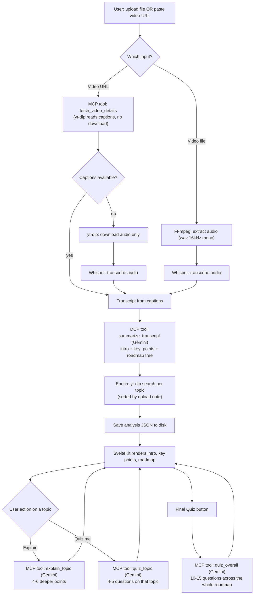
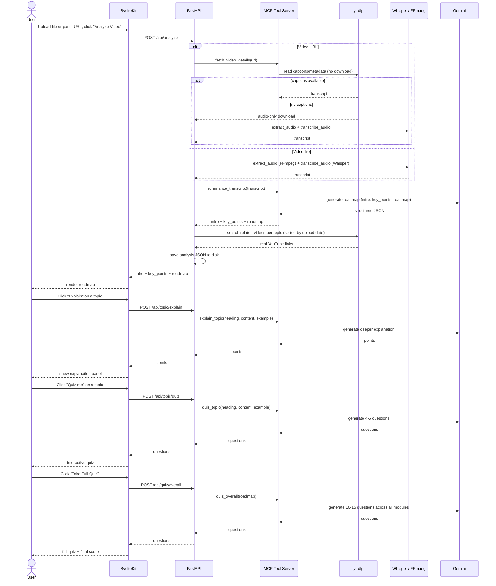

# AI-Video-Knowledge-Extractor

AI-powered video knowledge extractor that turns an uploaded video or a video URL (YouTube, etc.) into a transcript, an intro, key points, and an interactive learning roadmap — with AI explanations, per-topic quizzes, and a full quiz covering the whole video — using Whisper, Gemini, and yt-dlp, with a SvelteKit frontend and a FastAPI backend.

## Architecture

```
                                ┌─ captions available ──► Gemini ─┐
Video URL ──► yt-dlp (MCP) ─────┤                                  ├─► Roadmap + Quizzes ──► SvelteKit
                                └─ no captions ──► yt-dlp audio ──► Whisper ──► Gemini ─┘

Uploaded file ──► FFmpeg ──► Whisper ──► Gemini ──► Roadmap + Quizzes ──► SvelteKit
```

The user either uploads a video file or pastes a video URL from the SvelteKit UI.

- **URL flow**: the backend first tries to fetch existing captions/subtitles for the URL (no video/audio download) via an MCP tool server built on `yt-dlp`. If no usable captions exist, it falls back to downloading just the audio and transcribing it with Whisper.
- **File upload flow**: FFmpeg extracts audio from the uploaded video, then Whisper transcribes it.

Either way, the resulting transcript is sent to Gemini, which returns an intro, key points, and a roadmap of topics (with sub-topics, concrete examples pulled from the transcript, and cross-links between related topics). Each roadmap topic's suggested resources are then swapped for real, recently-uploaded YouTube videos via a `yt-dlp` search. From there, the user can ask Gemini to go deeper on any topic ("Explain"), quiz themselves on a single topic ("Quiz me"), or take a longer quiz covering the entire roadmap ("Final Quiz").

## Flow



1. The user uploads a video file or pastes a video URL in the SvelteKit UI and clicks **Analyze Video**.
2. **URL** → the FastAPI backend calls the `fetch_video_details` MCP tool, which uses `yt-dlp` to read the video's existing captions/subtitles without downloading anything.
   - If captions exist, that's the transcript.
   - If not, the backend downloads just the audio track (`yt-dlp`) and transcribes it with Whisper.
3. **File upload** → FFmpeg strips the audio out of the uploaded video, then Whisper transcribes it.
4. The transcript goes to the `summarize_transcript` MCP tool (Gemini), which returns an `intro`, `key_points`, and a `roadmap` tree of topics/sub-topics, each with an in-depth explanation and a concrete example pulled from the transcript.
5. Each roadmap topic's placeholder resources are replaced with real YouTube videos via a `yt-dlp` search sorted by upload date (most recent first).
6. The full analysis is saved to disk as JSON and returned to the frontend, which renders the intro, key points, and an interactive roadmap.
7. From there the user can, per topic, click **Explain** (`explain_topic` MCP tool) for a deeper AI breakdown, or **Quiz me** (`quiz_topic` MCP tool) for a short quiz on just that topic.
8. Once done with the roadmap, **Take Full Quiz** calls the `quiz_overall` MCP tool, which generates 10-15 questions spread across every module in the roadmap, then shows a final score with an option to retake.

### Sequence Diagram



## Why Each Technology

| Tech | Role | Why this one |
|---|---|---|
| **SvelteKit** | Frontend UI | Lets the user upload a video or paste a URL and interact with the results in a clean web page. |
| **FastAPI** | Backend orchestrator | Python backend — a natural fit since Whisper and most AI tooling are Python-native. |
| **MCP (Model Context Protocol)** | Tool server | Exposes the video-details fetch and every Gemini-backed step (summarize, explain, quiz, overall quiz) as MCP tools served by one local server, so the same tools are usable from any MCP client, not just this app. |
| **yt-dlp** | Captions, audio download, video search | Reads existing captions/metadata without downloading video, downloads just the audio when no captions exist, and searches YouTube for related videos — all with no API key needed. |
| **FFmpeg** | Audio extraction | Strips clean audio out of any uploaded video container for Whisper to consume. |
| **Whisper** | Speech-to-text | Turns spoken audio into text that other AI can reason over (used when no captions are available). |
| **Gemini** | Summarization / reasoning | Turns the raw transcript into an intro, key points, and a roadmap, and powers on-demand topic explanations and quizzes. |

## Features

- Upload a video file **or** paste a video URL (YouTube, Google Drive, etc.)
- Transcript extraction via captions first (fast, no download), falling back to Whisper transcription
- AI-generated intro, key points, and a topic roadmap (with sub-topics and concrete examples from the transcript)
- Real, recently-uploaded related YouTube videos suggested per topic
- **Explain**: an on-demand, deeper AI explanation for any topic
- **Quiz me**: a short multiple-choice quiz for a single topic
- **Final Quiz**: a longer (10-15 question) multiple-choice quiz covering the whole roadmap, with scoring and retake

## Project Structure

**Backend (FastAPI)**
- `backend/main.py` — FastAPI app, routes; run directly (`python main.py`) to start the API and its MCP tool server together
- `backend/requirements.txt` — Python dependencies
- `backend/mcp_server/video_details_server.py` — MCP tool server: `fetch_video_details`, `summarize_transcript`, `explain_topic`, `quiz_topic`, `quiz_overall`
- `backend/services/mcp_client.py` — client used by `main.py` to call the MCP tool server
- `backend/services/downloader.py` — yt-dlp caption fetching + audio download for URLs
- `backend/services/audio_extractor.py` — FFmpeg wrapper (uploaded files)
- `backend/services/transcriber.py` — Whisper wrapper
- `backend/services/summarizer.py` — Gemini transcript → roadmap
- `backend/services/topic_assistant.py` — Gemini topic explain / per-topic quiz / overall quiz
- `backend/services/video_search.py` — yt-dlp YouTube search for related videos, sorted by upload date
- `backend/uploads/` — temp storage for uploaded videos/audio
- `backend/summaries/` — saved JSON of each analysis result
- `backend/.env` — API keys (Gemini)

**Frontend (SvelteKit)**
- `frontend/src/routes/+page.svelte` — the whole UI: upload form, roadmap, explain/quiz panels, final quiz

## Out of Scope for V1

- No user accounts/auth
- No database (results are saved to disk as JSON, not queryable)
- No async job queues/background workers — processing happens synchronously per request
- No cloud storage — just local disk for temp files
- No streaming/progress bars — user waits for the full result

## Running Locally

Backend:
```bash
cd backend
python3 -m venv venv          # first time only
./venv/bin/pip install -r requirements.txt   # first time only
./venv/bin/python main.py     # starts the API on :8000 and its MCP tool server
```

Frontend:
```bash
cd frontend
npm run dev -- --open
```

Set `GEMINI_API_KEY` in `backend/.env` (see `backend/.env.example`) — get a free key at [aistudio.google.com/apikey](https://aistudio.google.com/apikey). FFmpeg must also be installed and on `PATH` for the file-upload transcription fallback.

## Status

Core pipeline, URL support with captions/Whisper fallback, the interactive roadmap UI, real related-video search, AI topic explain/quiz, the full-roadmap quiz, and the MCP tool server are all in place end-to-end.
